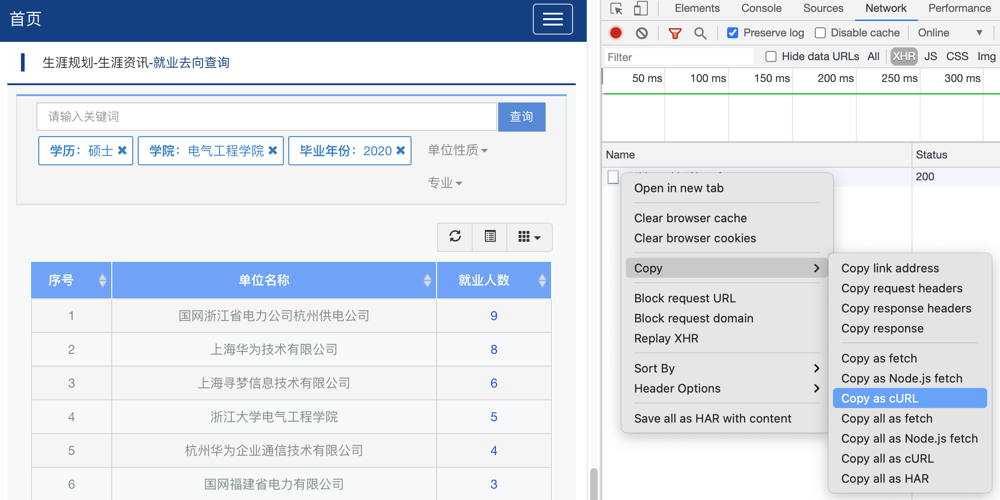
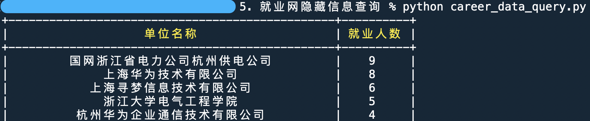

## 浙大的就业信息网是浙大众多垃圾网站中最的最垃圾的一个。

2021年了，才把2020年的数据放出来，2021年的数据更是只有一点点，而且前端还对年份做了限制。下面写一下获得2021年少得可怜的数据的方法，用Python是因为我对JS知之甚少。

1. 先随便设置一个年份，然后将其他筛选条件选好，打开**开发者工具**，复制cURL

2. 然后将复制的内容粘贴到 [curlconverter](https://curl.trillworks.com/) 中转化为Python代码，把`data`复制下来。（`headers`和`cookies`都不是必须的，这更说明就业网做的有多垃圾）

   为了防止内网信息泄漏，请从转化出的Python代码中获取目标 url

3. 运行程序，下图是以2021年电气硕士为例的运行结果。

PS：如果希望联系到具体在某个公司就业的同学，可以在开发者工具中查询他们的邮箱。为了防止个人信息泄漏，这里也不展开描述了。